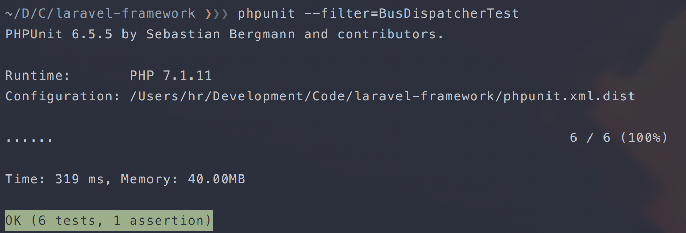
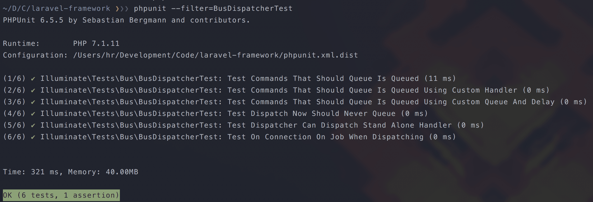

# 📋 Detailed PHPUnit Printer

It turns the default PHPUnit output...



... into a more informative output with readable function names and execution time allowing you to start fixing errors even before the whole suite finishes:



[](https://travis-ci.org/LimeDeck/phpunit-detailed-printer)
[](https://ci.appveyor.com/project/HRcc/phpunit-detailed-printer/branch/master)
[](https://github.com/limedeck/phpunit-detailed-printer)

## Installation

```
composer require limedeck/phpunit-detailed-printer --dev
```

### PHPUnit version compatibility

 PHPUnit  | Package
:---------|:----------
 7.x.x    | 4.x.x
 6.x.x    | 3.2.x
 5.x.x    | 2.0.x


## Usage

Set the printer class in `phpunit.xml`

```
<?xml version="1.0" encoding="UTF-8"?>
<phpunit backupGlobals="false"
         ...
         printerClass="LimeDeck\Testing\Printer"
         ...
         >
```

## Tests
To run the test suite, use `phpunit` command.

## Contributing
Thanks for your interest in PHPUnit Detailed Printer! If you'd like to contribute, please read our [contributing guide](CONTRIBUTING.md).

## License

Detailed PHPUnit Printer is open-sourced software licensed under the MIT license. If you'd like to read the license agreement, click [here](LICENSE).
